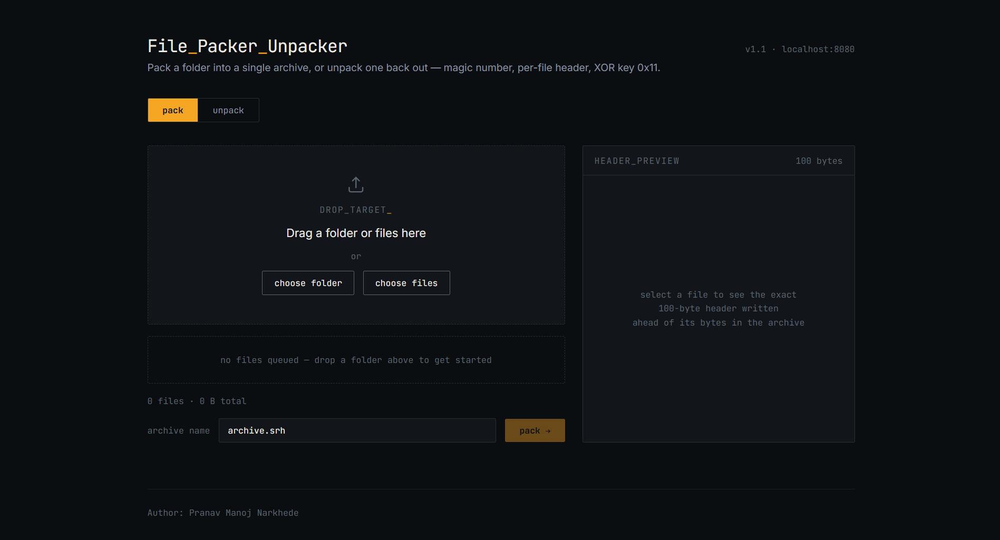
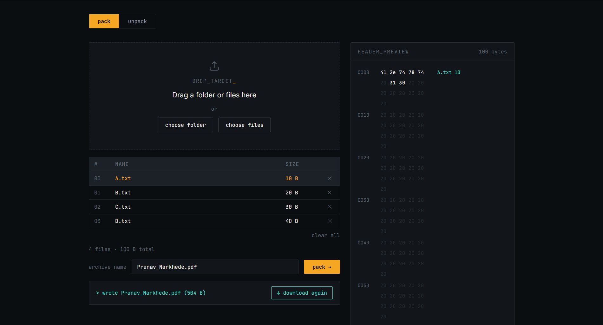
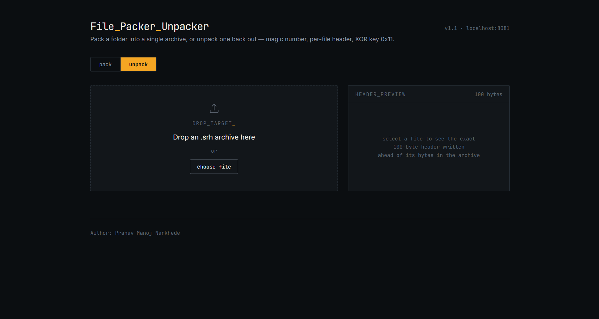
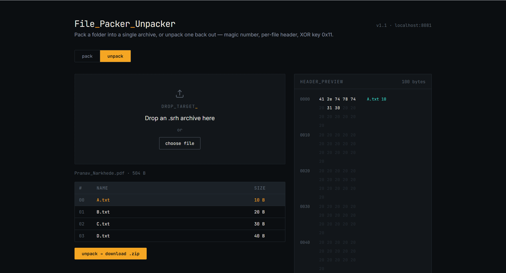

# File_Packer_Unpacker

A full-stack web application for packing files into a custom binary archive and unpacking them back out — validated with a custom magic number (`SRH3`), fixed-size per-file headers, and XOR-based encoding.

Originally built as a Java CLI tool (`packer.java` / `unpacker.java`), then extended into a complete web application with a Spring Boot REST API and a React frontend, without changing the underlying archive layout — archives created in the browser are fully compatible with the original CLI tools, and vice versa.

---

## Screenshots

### Pack

| Empty state | Files queued |
|:---:|:---:|
|  |  |

### Unpack

| Empty state | Archive inspected |
|:---:|:---:|
|  |  |

---

## Features

- **Pack** any folder or set of files into a single `.srh` archive, directly from the browser
- **Unpack** an `.srh` archive back into its original files, downloaded as a `.zip`
- **Live header preview** — before packing, see the exact 100-byte header (as a hex + ASCII dump) that will be written for any selected file
- **Archive inspection** — before unpacking, see the file names and sizes contained in an archive without extracting anything
- **Format-safe validation** — rejects files whose name won't fit the archive's fixed 100-byte header, and rejects corrupted or non-archive files via magic-number and size checks
- **CLI-compatible** — the original Java CLI tools still work against archives produced by the web app

---

## Tech Stack

| Layer | Technology |
|---|---|
| Backend | Java 17, Spring Boot 3, Maven |
| Frontend | React, Vite, Tailwind CSS |
| Testing | JUnit 5, Spring Boot Test |
| Original CLI | Java (`packer.java`, `unpacker.java`) |

---

## How the Archive Works

Every packed file starts with a 4-byte **magic number**, `SRH3`. This is not a format name — it's just a fixed signature written at the start of the archive so the unpacker can verify the file before trusting it. When unpacking, the first check is whether those 4 bytes equal `SRH3`; if they don't, the file is rejected immediately as invalid, regardless of what it's named or renamed to.

After the magic number, each packed file is stored as:

```
[100 bytes]  header — "<filename> <size>" padded with spaces
[N bytes]    file content, each byte XORed with key 0x11
```

This layout is unchanged from the original CLI tool, which is why archives are interchangeable between the CLI and the web app in both directions.

---

## Project Structure

```
File_Packer_Unpacker/
├── backend/            Spring Boot REST API
│   └── src/main/java/com/sanket/filepacker/
│       ├── controller/     REST endpoints (pack, unpack, inspect)
│       ├── service/        PackerService, UnpackerService
│       ├── dto/             ArchiveEntry, ExtractedFile
│       ├── config/          CORS configuration
│       └── exception/       Global error handling
├── frontend/           React + Tailwind UI
│   └── src/
│       ├── components/      DropZone, FileTable, HexPreview, PackPanel, UnpackPanel
│       └── utils/            Byte formatting, header hex-dump helpers
├── cli-reference/      Original packer.java / unpacker.java
└── docs/assets/        Screenshots
```

---

## Getting Started

### Backend

Requires JDK 17+ and Maven.

```bash
cd backend
mvn spring-boot:run
```

Runs on `http://localhost:8080`. Health check: `GET /api/health`.

### Frontend

Requires Node 18+.

```bash
cd frontend
npm install
cp .env.example .env
npm run dev
```

Runs on `http://localhost:5173`.

### Tests

```bash
cd backend
mvn test
```

Covers the magic number, exact header byte layout, XOR encoding, oversized-name rejection, multi-file packing, a full pack → unpack round trip, and corrupt/truncated archive handling.

---

## API

| Method | Endpoint | Description |
|---|---|---|
| `POST` | `/api/pack` | Packs uploaded files into a `.srh` archive |
| `POST` | `/api/inspect` | Returns file names/sizes in an archive without extracting |
| `POST` | `/api/unpack` | Unpacks an archive and returns a `.zip` of the contents |
| `GET` | `/api/health` | Health check |

---

## Author

**Pranav Manoj Narkhede**
